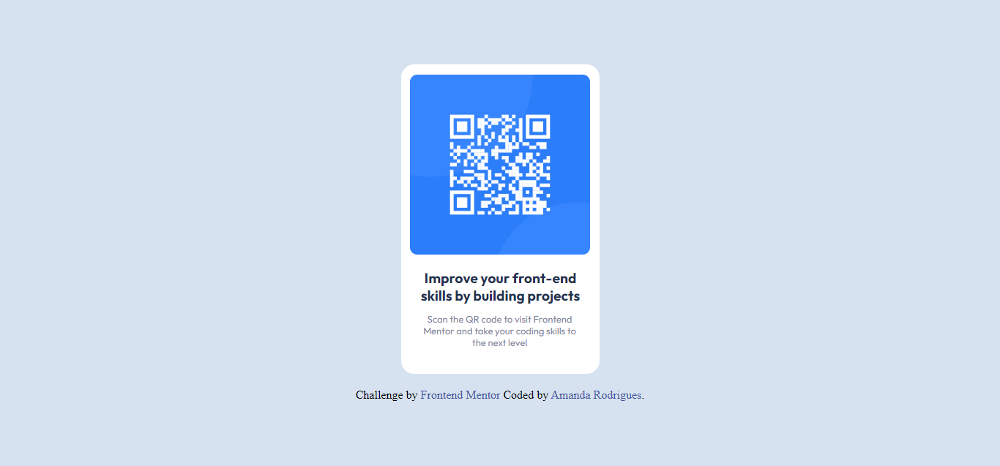

# Frontend Mentor - solução de componente de código QR

Esta é uma solução para o [desafio do componente de código QR no Frontend Mentor](https://www.frontendmentor.io/challenges/qr-code-component-iux_sIO_H). Os desafios do Frontend Mentor ajudam você a melhorar suas habilidades de codificação através da construção de projetos realistas.

### Screenshot

### Construído com

- Marcação HTML5 semântica
- Propriedades personalizadas CSS
- Caixa flexível
- Grade CSS
- Fluxo de trabalho voltado para dispositivos móveis

